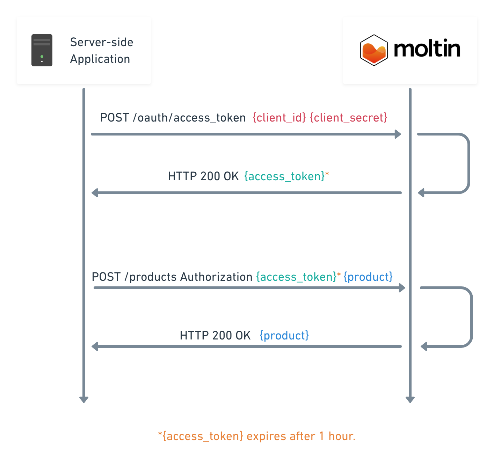

# Client credential token

A `client_credentials` token is used when the credentials are not publicly exposed, usually a server-side language such as PHP or Node.js. This type of authentication enables CRUD access to all resources.


`client_credentials` allows full read and write access to endpoints.


The diagram below illustrates the process flow for authentication for a server-side client credential application and a subsequent request to POST products.





Create a client credential token










The grant type, in this case it must be **client\_credentials**



Your **client\_secret**



Your **client\_id**










```javascript
{
    "expires": 1524486008,
    "identifier": "client_credentials",
    "expires_in": 3600,
    "access_token": "xa3521ca621113e44eeed9232fa3e54571cb08bc",
    "token_type": "Bearer"
}
```







```bash
curl -X "POST" "https://api.moltin.com/oauth/access_token" \
     -d "client_id=XXXX" \
     -d "client_secret=XXXX" \
     -d "grant_type=client_credentials"
```



```javascript
const MoltinGateway = require('@moltin/sdk').gateway

const Moltin = MoltinGateway({
  client_id: 'X',
  client_secret: 'X'
})
```



